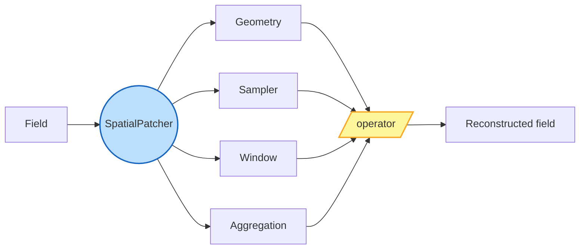
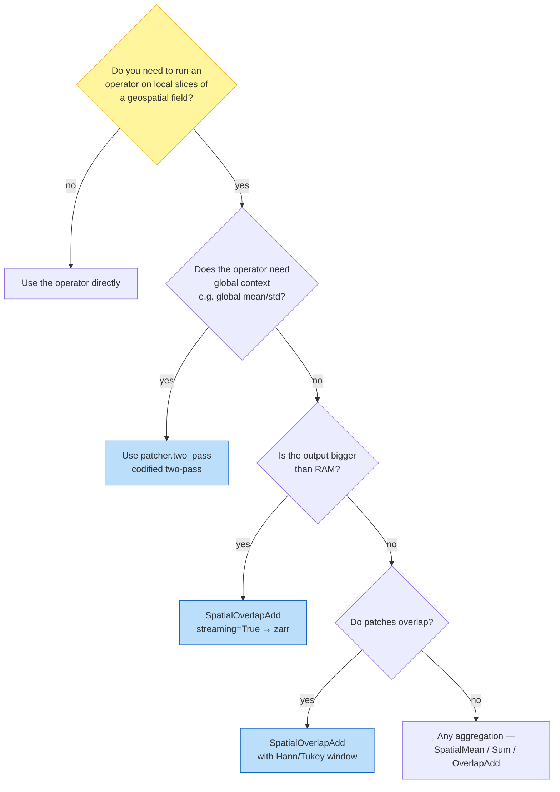

# geopatcher

> **The locality layer.** Split a geospatial field into local patches,
> run an operator per patch, stitch the local outputs back into a global
> field — along four independently composable axes.

## Three patcher families

| Patcher | Domain | Typical use |
|---|---|---|
| `SpatialPatcher` | space (raster / grid / vector / point) | sliding-window inference, COG tiling, hierarchical patching |
| `TemporalPatcher` | time | rolling lookback windows, forecasts, multi-scale folds |
| `SpatioTemporalPatcher` | space × time | event-triggered cubes, dense climate output, satellite revisits |

Each composes **four orthogonal axes** — Geometry, Sampler, Window,
Aggregation — over a `Field` Protocol that adapts the backend substrate
(raster, xarray, GeoPandas, xvec, …).

## Is this the right tool?

## Mental model

`geopatcher` is the **locality layer** of a three-package stack:

- [**geocatalog**](https://github.com/jejjohnson/geocatalog) decides
  *which data* to read (STAC searches, time ranges, AOIs, asset
  resolution).
- [**geotoolz**](https://github.com/jejjohnson/geotoolz) decides *what to
  compute* (operator graphs, lazy `Sequential` pipelines).
- **geopatcher** decides *what slice the operator sees at once and how
  local outputs become a global field* — the third orthogonal question
  the other two libraries deliberately don't answer.

You can use `geopatcher` without either of the other two; you can also
plug it into a `pipekit.Sequential` pipeline through the
`geopatcher.integrations.pipekit` submodule.

## Where to go next

- **[Concepts](concepts.md)** — the four-axis abstraction, boundary
  policies, determinism contracts, streaming vs eager, hooks.
- **[Quickstart](quickstart.md)** — 15-minute walkthrough on a real
  Lake Tahoe Sentinel-2 scene.
- **[Recipes](recipes/streaming-overlap-add.md)** — bounded-memory
  pipelines, on-error policies, PatchJournal resume.
- **[Tutorials](notebooks/patcher_lake_tahoe.ipynb)** — the patcher
  slice of the Lake Tahoe scenario plus the nine existing intro /
  samplers / geometries / backends / time / streaming notebooks.
- **[Design decisions](decisions.md)** — locked-in ADRs.
- **[API reference](api/reference.md)** — generated from docstrings.

**See the full end-to-end story** in the canonical cross-repo notebook:
[`geocatalog/docs/notebooks/end_to_end_lake_tahoe.ipynb`](https://github.com/jejjohnson/geocatalog/blob/main/docs/notebooks/end_to_end_lake_tahoe.ipynb)
— a single Sentinel-2 / Lake Tahoe / summer-2024 scenario that touches
the catalog (geocatalog), the operator graph (geotoolz), and the
patcher (geopatcher) end-to-end.
